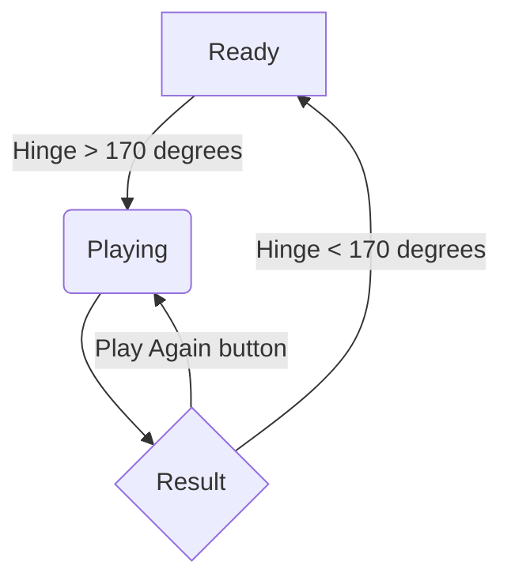
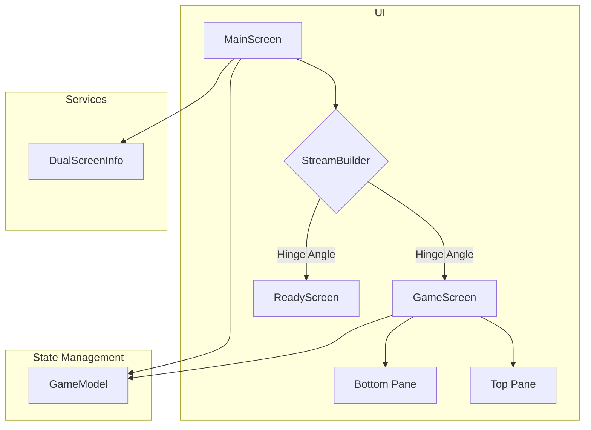

# Rock-Paper-Scissors App for Foldable Devices Design Document

## Overview

This document outlines the design for a Rock-Paper-Scissors game application specifically designed for foldable devices. The app will leverage the unique form factor of these devices, using the hinge-opening action to trigger a new game.

## Detailed Analysis

The core problem is to create an engaging user experience that is unique to foldable devices. The application will use the `dual_screen` package to detect the hinge angle. When the hinge is opened beyond a certain threshold (e.g., 170 degrees), the game will automatically start.

The game logic is simple:
1.  The app starts in a "Ready" state when the device is closed or partially open.
2.  When the hinge is fully opened, the game starts.
3.  The computer's hand is chosen randomly.
4.  The user's hand is also chosen randomly.
5.  The winner is determined based on the rules of Rock-Paper-Scissors.
6.  The result and the hands are displayed on the screen.
7.  A score is kept to track wins, losses, and draws.
8.  A "Play Again" button allows the user to play another round without closing and opening the device.

## Alternatives Considered

*   **Manual Trigger:** Instead of using the hinge, a button could be used to trigger the game. This would make the app compatible with all devices, but it would lose the unique foldable device experience.
*   **User's Choice:** The user could be allowed to choose their hand instead of it being random. This would make it a more traditional Rock-Paper-Scissors game, but the current proposal focuses on a quick, surprising interaction.

## Detailed Design

### State Management

We will use the `ChangeNotifier` and `Provider` packages for state management. A `GameModel` class will extend `ChangeNotifier` and hold the application's state, including:

*   `userHand`: The user's current hand.
*   `computerHand`: The computer's current hand.
*   `result`: The result of the last game.
*   `wins`, `losses`, `draws`: The score.
*   `gameState`: The current state of the game (`ready`, `playing`, `result`).

### UI Design

The UI will be built using Flutter's widget system.

*   **`MainScreen`:** A `StatelessWidget` that will be the main entry point of the app. It will use a `StreamBuilder` to listen to `DualScreenInfo.hingeAngleEvents`.
*   **`GameScreen`:** A `StatelessWidget` that will display the game UI. It will be shown when the `gameState` is `playing` or `result`. It will be split into two panes.
    *   **Top Pane:** Shows the computer's hand.
    *   **Bottom Pane:** Shows the user's hand, the result, the score, and the "Play Again" button.
*   **`ReadyScreen`:** A `StatelessWidget` that will be shown when the `gameState` is `ready`.

### Hinge Angle Detection

We will use the `dual_screen` package to detect the hinge angle. The `DualScreenInfo.hingeAngleEvents` stream provides the hinge angle. We will listen to this stream and trigger the game when the angle exceeds 170 degrees. We will also check if the device has a hinge angle sensor using `DualScreenInfo.hasHingeAngleSensor`.

## Diagrams

### State Diagram

### Component Diagram

## Summary

The proposed design provides a simple yet engaging Rock-Paper-Scissors game that takes advantage of the unique features of foldable devices. The use of the `dual_screen` package for hinge angle detection is central to the app's design. The state will be managed by a `ChangeNotifier`, and the UI will be composed of simple, reusable widgets.

## References

*   [dual_screen package (pub.dev)](https://pub.dev/packages/dual_screen)
*   [Flutter State Management (flutter.dev)](https://docs.flutter.dev/data-and-backend/state-mgmt/simple)
